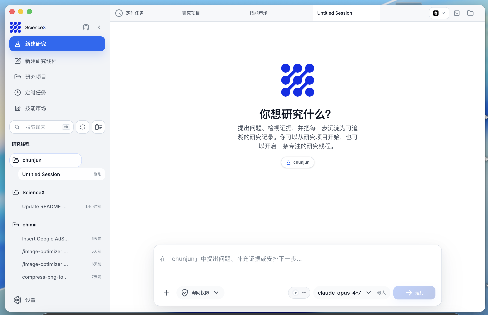

# ScienceX
<p align="center">
  
</p>


ScienceX is an open-source AI workbench for scientific research. It aims to be a local-first, self-hostable alternative to [Claude Science](https://www.anthropic.com/news/claude-science-ai-workbench), bringing experiment data, agent sessions, reproducible runs, provenance, and research artifacts into one macOS / Windows / Linux desktop environment. Researchers can choose their model provider, extend the system through Skills and MCP, and retain control over local files and computation.

> **Independent project:** ScienceX is not an Anthropic product and is not affiliated with or endorsed by Anthropic. The current release is building toward an open Claude Science-style workflow; it does not claim feature parity with Anthropic's product.

<p align="center">
  <a href="#why-sciencex">Why ScienceX</a> · <a href="#current-capabilities">Current Capabilities</a> · <a href="#quick-start">Quick Start</a> · <a href="#roadmap">Roadmap</a> · <a href="#documentation">Docs</a>
</p>

---

## Why ScienceX

Anthropic describes Claude Science as a workbench that integrates scientific tools and packages, produces auditable artifacts, and provides flexible access to compute. ScienceX pursues the same class of workflow through open source, with five design principles:

- **Local first**: experiment tables, run records, and artifacts stay on infrastructure controlled by the researcher.
- **Auditable and replayable**: input hashes, parameters, environments, state transitions, event logs, and artifact hashes form end-to-end provenance.
- **Model neutral**: use Anthropic-compatible APIs, third-party models, or custom providers without tying the research workflow to one subscription.
- **Openly extensible**: connect existing tools through Skills, MCP, SubAgents, terminals, and Computer Use.
- **Cross-platform and self-hostable**: run the desktop app on macOS, Windows, or Linux while controlling the server and storage locations.

ScienceX is not a single-purpose chat box. It combines a research layer for projects, dataset versions, runs, and artifacts with a general agent layer for model routing, multi-session execution, permission review, and desktop automation.

<p align="center">
  <a href="docs/en/science/01-deployment-and-workflow.md"></a>
   
  <a href="https://github.com/insight68/sciencex/releases"></a>
</p>

---

## Current capabilities

| Status            | Capability                | Current behavior                                                                                            |
| ----------------- | ------------------------- | ----------------------------------------------------------------------------------------------------------- |
| ✅ Available      | Research projects         | Creates a`.sciencex` manifest and SQLite research database in a local directory                           |
| ✅ Available      | Experiment-table registry | Supports UTF-8 CSV/TSV and records canonical path, size, modification time, and SHA-256 versions            |
| ✅ Available      | Local data profiling      | Infers column types and measures sampled missing values, uniqueness, complete rows, and numeric columns     |
| ✅ Available      | Traceable Runs            | Records explicit`queued / running / completed / failed / interrupted` states, parameters, and environment |
| ✅ Available      | Provenance                | Persists append-only`events.jsonl`, Run manifests, input hashes, and recipe hashes                        |
| ✅ Available      | Artifacts                 | Produces registered`quality-report.md` and `profile.json` files with size and content hashes            |
| ✅ Available      | Replay and staleness      | Replays history as child Runs and marks old Runs`stale` after a new dataset version                       |
| ✅ Available      | Agent infrastructure      | Multi-model, multi-session, Skills, MCP, SubAgents, terminal, Computer Use, and permission review           |
| 🚧 In development | General compute           | Controlled Python / Jupyter / R, dependency locking, and Restart & Run All                                  |
| 🚧 In development | Scientific connectors     | Literature, scientific databases, internal lab data, and HPC/scheduler connectors                           |
| 🚧 In development | Rich scientific artifacts | Code-linked figures, manuscripts, domain renderers, and reviewer agents                                     |

The current `table-quality-v1` recipe profiles at most 100 safely parsed sample rows. It checks structure and data quality; it is **not full-dataset statistics, significance testing, or a scientific conclusion**.

## Core workflow

1. **Create a research project** in an existing local directory and record the research question.
2. **Register an experiment table** and create a dataset version from its full-file SHA-256.
3. **Inspect the data structure** on the Data page, including column profiles, missing values, and sampled rows.
4. **Run the quality recipe** while recording inputs, environment, parameters, and state transitions.
5. **Review and replay** provenance in Runs and reports in Artifacts without overwriting history.

```text
research-directory/
├── data/experiment.csv
├── .sciencex/
│   ├── project.yaml
│   ├── research.sqlite
│   └── runs/<run-id>/{run.json,events.jsonl}
└── artifacts/sciencex/<run-id>/{quality-report.md,profile.json}
```

Registration stores the source table's absolute path; it does not copy the original data. Keep data under the project's `data/` directory when possible, and back up the data, `.sciencex/`, and `artifacts/` together.

## Quick start

### Install the desktop app

Download a macOS / Windows / Linux installer that includes the Science workbench from [Releases](https://github.com/insight68/sciencex/releases). If the latest published release does not include the newest Science work, use the source workflow below.

### Run the complete desktop app from source

```bash
git clone https://github.com/insight68/sciencex.git
cd sciencex
bun install

cd desktop
bun install
bun run build:sidecars
bun run electron:dev
```

Open **Science** from the left navigation after the desktop window appears. Creating projects, previewing tables, and running `table-quality-v1` do not require a model API key. Configure a provider only when using AI agent chat.

See [Science Deployment &amp; Workflow](docs/en/science/01-deployment-and-workflow.md) for packaging, REST APIs, storage, and troubleshooting. See [Environment Variables](docs/en/guide/env-vars.md) and [Third-Party Models](docs/en/guide/third-party-models.md) for model configuration.

## Agent and desktop foundation

- **Multi-session and multi-project**: manage research conversations, project context, background tasks, and agent teams in parallel.
- **Multi-model and BYOK**: use Anthropic-compatible APIs, third-party models, or custom local provider configuration.
- **Skills, MCP, and SubAgents**: package research tools as reusable capabilities and delegate bounded tasks in parallel.
- **Terminal and file changes**: inspect commands, file writes, code diffs, and run output inside the workbench.
- **Permission review**: approve risky commands, tool calls, and model follow-up questions in the GUI.
- **Computer Use and remote access**: control desktop applications after approval and reach running sessions through H5 or IM adapters.

These capabilities come from the project's existing general agent runtime and are being shaped into a research-focused plan, execute, review, and reproduce workflow.

## Roadmap

- [X] Local research projects, dataset versions, and general experiment tables.
- [X] Deterministic quality profiling, Run state machine, provenance, and artifacts.
- [X] Run replay, dataset-change detection, and old-schema migration.
- [ ] Controlled Python / Jupyter / R runtimes with locked environments.
- [ ] Standard `.ipynb` generation, Restart & Run All, and cell-level execution evidence.
- [ ] Two-way links between figures, statistical tables, manuscripts, and generating code.
- [ ] Literature search, citation evidence stores, and scientific database connectors.
- [ ] Installable capability packs for bioinformatics, chemistry, clinical research, and other domains.
- [ ] Reviewer agents for citations, untraceable numbers, and figure/code mismatches.
- [ ] Team collaboration, remote compute, and HPC job execution.

Use Issues to discuss priorities. Production research must retain human review, independent validation, and domain-expert judgment.

---

## Documentation

| Document                                                                          | Description                                                                                                                                                                    |
| --------------------------------------------------------------------------------- | ------------------------------------------------------------------------------------------------------------------------------------------------------------------------------ |
| [Science Deployment &amp; Workflow](docs/en/science/01-deployment-and-workflow.md) | Source startup, desktop packaging, execution, provenance, artifacts, and REST APIs                                                                                             |
| [Environment Variables](docs/en/guide/env-vars.md)                                 | Model-provider and runtime configuration                                                                                                                                       |
| [Third-Party Models](docs/en/guide/third-party-models.md)                          | Using OpenAI / DeepSeek / Ollama and other non-Anthropic models                                                                                                                |
| [Contributing](docs/en/guide/contributing.md)                                      | Local tests, live model baselines, PR gates, and release gates                                                                                                                 |
| [Memory System](docs/en/memory/01-usage-guide.md)                                  | Cross-session persistent memory usage and implementation                                                                                                                       |
| [Multi-Agent System](docs/en/agent/01-usage-guide.md)                              | Agent orchestration, parallel tasks and Teams collaboration                                                                                                                    |
| [Skills System](docs/en/skills/01-usage-guide.md)                                  | Extensible capability plugins, custom workflows and conditional activation                                                                                                     |
| [IM Integration](docs/im/)                                                         | Remote chat, project switching, and permission approval via Telegram / Feishu / WeChat / DingTalk                                                                              |
| [Computer Use](docs/en/features/computer-use.md)                                   | Desktop control (screenshots, mouse, keyboard) —[Architecture](docs/en/features/computer-use-architecture.md)                                                                  |
| [Desktop App](docs/desktop/)                                                       | Electron + React GUI client —[Quick Start](docs/desktop/01-quick-start.md) \| [Architecture](docs/desktop/02-architecture.md) \| [Installation](docs/desktop/04-installation.md) |
| [Global Usage](docs/en/guide/global-usage.md)                                      | Run sciencex from any directory                                                                                                                                                |
| [FAQ](docs/en/guide/faq.md)                                                        | Common error troubleshooting                                                                                                                                                   |
| [Project Structure](docs/en/reference/project-structure.md)                        | Code directory structure                                                                                                                                                       |

---

## Sponsorship & Partnership

This project is maintained by **iteamify.com**. Corporate or individual sponsorships are welcome to support ongoing development. Custom features, integrations, and business partnerships are also open for discussion.

📧 **Contact**: hello@iteamify.com

---

## ☕ Buy Me a Coffee

If this project helps you, consider buying me a coffee — every bit of support keeps this project going ❤️

<table>
<tr>
<td align="center" width="33%">
<br>
<b>WeChat Pay</b>
</td>
<td align="center" width="33%">
<br>
<b>Alipay</b>
</td>
<td align="center" width="33%">
<a href="https://buymeacoffee.com/agentpage" target="_blank">

</a><br>
<b>Buy Me a Coffee</b>
</td>
</tr>
</table>

---

## Tech Stack

| Category                     | Technology                                       |
| ---------------------------- | ------------------------------------------------ |
| Language                     | TypeScript                                       |
| Desktop app                  | Electron                                         |
| Desktop UI                   | React + Vite                                     |
| Local runtime                | [Bun](https://bun.sh)                             |
| Research data and provenance | SQLite + YAML + JSONL                            |
| Terminal UI                  | React +[Ink](https://github.com/vadimdemedes/ink) |
| CLI parsing                  | Commander.js                                     |
| Model integration            | Anthropic SDK + multi-provider adapters          |
| Protocols                    | MCP, LSP                                         |

## Acknowledgments

Thanks to the following open-source projects and community practices for reference and inspiration:

- [React](https://github.com/facebook/react): frontend engineering and component-based UI ecosystem.
- [Electron](https://github.com/electron/electron): cross-platform desktop app capabilities and engineering practices.
- [Claude Science](https://www.anthropic.com/news/claude-science-ai-workbench): product-direction reference for an open scientific workbench; ScienceX is not affiliated with or endorsed by Anthropic.

---

## ⭐ Star History

If this project helps you, please support it with a ⭐ Star so more people can discover ScienceX.

<a href="https://www.star-history.com/#agentpage/sciencex&Date">
  <picture>
    <source media="(prefers-color-scheme: dark)" srcset="https://api.star-history.com/svg?repos=agentpage/sciencex&type=Date&theme=dark" />
    <source media="(prefers-color-scheme: light)" srcset="https://api.star-history.com/svg?repos=agentpage/sciencex&type=Date" />
    
  </picture>
</a>

---

<p align="center">
  <sub>© 2026 <a href="https://iteamify.com">iteamify.com</a>. Licensed under the <a href="LICENSE">MIT License</a>.</sub>
</p>
