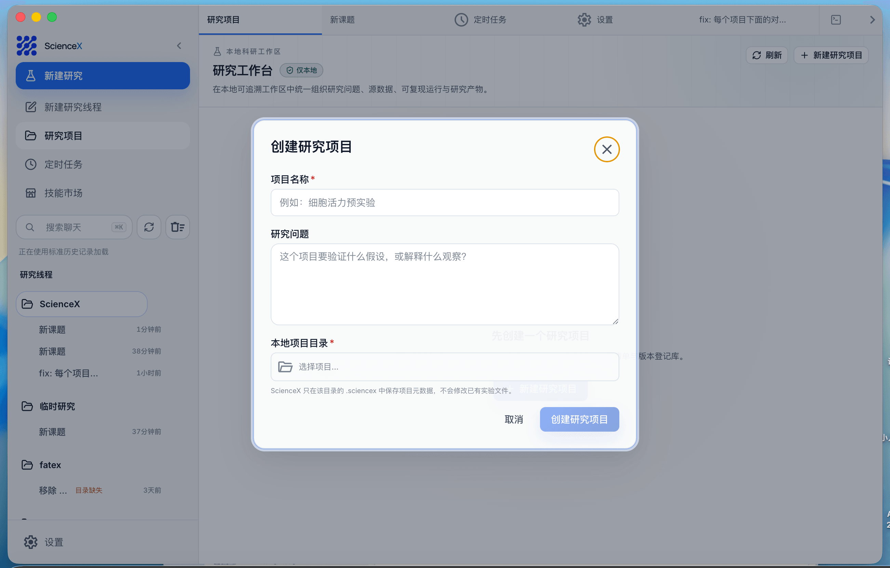
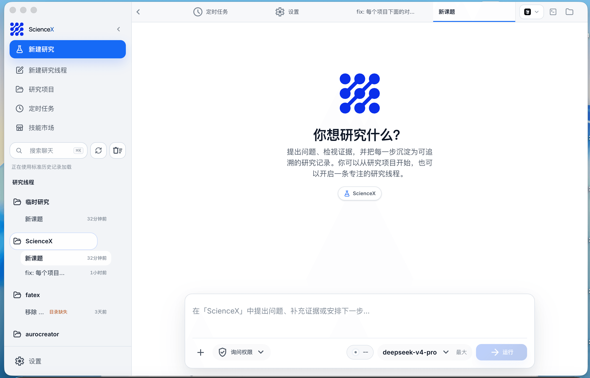

[English](README.en.md) | [中文](README.md)

# ScienceX

<p align="center">
  
</p>

<p align="center"><strong>让研究问题、证据与下一步始终相连</strong></p>

ScienceX 是开源、本地优先的 AI 科研工作台。它将研究问题、版本化实验设计、实验数据、确定性分析和研究产物保留在同一条可追溯的研究链路中。

> **独立项目声明：** ScienceX 不是 Anthropic 产品，也不隶属于或代表 Anthropic。当前版本正在建设 Claude Science 式的开放科研工作流，不宣称与官方产品功能完全对等。

<p align="center">
  <a href="#为什么选择-sciencex">为什么选择</a> · <a href="#当前能力">当前能力</a> · <a href="#快速开始">快速开始</a> · <a href="#路线图">路线图</a> · <a href="#更多文档">文档</a>
</p>

---

## 为什么选择 ScienceX

科研工作常被拆散在聊天、文献、代码、数据文件和报告之间。ScienceX 用一个开放的本地工作台承载这些环节，并强调五个原则：

- **本地优先**：实验表格、运行记录和产物保存在研究者自己的机器或基础设施上。
- **可审计、可重放**：输入哈希、参数、运行环境、状态转换、事件日志和产物哈希形成完整 Provenance。
- **模型中立**：支持 Anthropic 兼容 API、第三方模型和自定义提供商，不把科研工作流绑定到单一订阅。
- **开放扩展**：通过 Skills、MCP、SubAgent、终端和 Computer Use 接入研究者已有的工具。
- **跨平台、自部署**：桌面端支持 macOS、Windows 和 Linux；服务端与数据目录都由用户控制。

ScienceX 的基础不是一个单用途聊天框，而是两层协同的本地工作台：上层负责研究项目、数据版本、运行和产物；下层提供多会话 Agent、工具执行、权限审批、模型路由和桌面自动化。

<p align="center">
  <a href="docs/science/01-deployment-and-workflow.md"></a>
  &nbsp;
  <a href="https://github.com/insight68/sciencex/releases"></a>
</p>

---

## 当前能力

| 状态 | 能力 | 当前行为 |
| --- | --- | --- |
| ✅ 可用 | 研究项目 | 在本地目录创建 `.sciencex` manifest 和 SQLite 研究数据库 |
| ✅ 可用 | 细胞活力实验蓝图 | 创建带版本的 CCK-8 / CellTiter-Glo 方案，校验剂量、对照、复孔与 96 孔板布局 |
| ✅ 可用 | 实验表格登记 | 支持 UTF-8 CSV/TSV，记录规范化路径、大小、修改时间和 SHA-256 版本 |
| ✅ 可用 | 本地数据画像 | 推断列类型，统计样本中的缺失值、唯一值、完整行和数值列 |
| ✅ 可用 | 细胞活力剂量反应 | 显式孔位/信号映射、空白扣除、溶剂对照归一化、复孔汇总和确定性 4PL / 相对 IC50 拟合 |
| ✅ 可用 | 可追溯 Run | 显式记录 `queued / running / completed / failed / interrupted` 状态、参数和运行环境 |
| ✅ 可用 | Provenance | 保存 append-only `events.jsonl`、Run manifest、输入哈希和配方哈希 |
| ✅ 可用 | Artifacts | 生成并登记质量报告、归一化孔级数据、4PL 结果 JSON，保存大小和内容哈希 |
| ✅ 可用 | 精确重放与输入版本状态 | 历史 Run 固定原始数据版本重放；首次运行待验证，确定性结果一致后标记重放验证通过 |
| ✅ 可用 | Agent 基础设施 | 多模型、多会话、Skills、MCP、SubAgent、终端、Computer Use、权限审批 |
| 🚧 开发中 | 通用计算环境 | 受控 Python / Jupyter / R、依赖锁定和 Restart & Run All |
| 🚧 开发中 | 科研连接器 | 文献、科学数据库、实验室内部数据和 HPC / 调度系统连接器 |
| 🚧 开发中 | 富科研产物 | 图表与代码绑定、论文稿件、领域可视化和 Reviewer Agent |

实验蓝图中的“可执行”只表示必要的设计字段和孔板分配已通过确定性检查，不代表湿实验已经完成或科学结果有效。`table-quality-v1` 最多画像 100 个安全解析的样本行；`cell-viability-dose-response-v1` 会完整读取已锁定的单板数据版本，并要求每个设计孔恰好对应一个数值信号。它报告的是无置信区间的单板相对 IC50，**不构成生物学重复推断、显著性检验、统计签署或科学结论**。

<p align="center">
  
</p>

## 核心工作流

1. **创建研究项目**：选择一个本地目录，记录项目名称和研究问题。
2. **设计细胞活力实验**：记录细胞系、化合物、检测方法、剂量、对照和复孔，生成 96 孔板蓝图并通过就绪检查。
3. **执行并登记实验表格**：人工审阅方案并完成湿实验，再添加 CSV/TSV，计算完整文件 SHA-256 并创建数据版本。
4. **检查数据结构**：在 Data 页查看列画像、缺失值和样本行。
5. **执行分析**：可运行通用质量画像，或从实验蓝图显式选择孔位/信号列并完成空白扣除、归一化、复孔汇总和 4PL 拟合。
6. **审阅与重放**：在 Runs 查看 Provenance，在 Artifacts 查看报告或以新 Run 重放。

```text
研究目录/
├── data/experiment.csv
├── .sciencex/
│   ├── project.yaml
│   ├── research.sqlite
│   └── runs/<run-id>/{run.json,events.jsonl}
└── artifacts/sciencex/<run-id>/{quality-report.md,profile.json,dose-response-report.md,normalized-wells.csv,dose-response.json}
```

表格登记会保存原文件绝对路径，并在 `.sciencex/objects/sha256/` 创建按内容寻址的只读快照。快照用于精确重放；原路径仍用于当前表格预览和再次登记。建议将项目目录整体备份，原始实验文件仍应按实验室数据保留策略单独保存。

## 快速开始

### 安装桌面端

从 [Releases](https://github.com/insight68/sciencex/releases/latest) 下载对应平台的安装包：

<p align="center">
  <a href="https://github.com/insight68/sciencex/releases/latest">
    
  </a>
  &nbsp;
  <a href="https://github.com/insight68/sciencex/releases/latest">
    
  </a>
  &nbsp;
  <a href="https://github.com/insight68/sciencex/releases/latest">
    
  </a>
</p>

| 平台 | 架构 | 安装包格式 |
| --- | --- | --- |
| macOS | Apple Silicon (ARM64) / Intel (x64) | `.dmg` / `.zip` |
| Windows | x64 / ARM64 | `.exe` (NSIS) |
| Linux | x86_64 / ARM64 | `.AppImage` / `.deb` |

正式 Release 尚未包含最新 Science 功能时，请使用下面的源码方式。

### 从源码运行完整桌面端

```bash
git clone https://github.com/insight68/sciencex.git
cd sciencex
bun install

cd desktop
bun install
bun run build:sidecars
bun run electron:dev
```

打开桌面窗口后，从左侧进入 **Science**。项目创建、表格预览和 `table-quality-v1` 不需要模型 API Key；只有使用 AI Agent 对话时才需要配置提供商。

完整部署、打包、REST API 和故障排查见 [Science 部署与实验执行](docs/science/01-deployment-and-workflow.md)。模型配置见[环境变量](docs/guide/env-vars.md)和[第三方模型](docs/guide/third-party-models.md)。

## Agent 与桌面基础设施

- **多会话与多项目**：并行管理研究会话、项目上下文、后台任务和团队 Agent。
- **多模型与 BYOK**：使用 Anthropic 兼容 API、第三方模型或自定义本地配置。
- **Skills / MCP / SubAgent**：把科研工具封装成可复用能力，并行执行有边界的子任务。
- **终端与文件变更**：在工作台中检查命令、文件写入、代码 Diff 和运行输出。
- **权限与确认流**：危险命令、工具调用和 AI 反问可在桌面端集中审批。
- **Computer Use 与远程入口**：授权后操作桌面应用，并通过 H5 或 IM 接入正在运行的会话。

这些能力来自项目现有的通用 Agent runtime，并逐步收敛为面向科研的计划、执行、审阅和复现工作流。

## 路线图

- [x] 本地研究项目、数据版本和通用实验表格。
- [x] 板式细胞活力实验蓝图、协议/设计版本、执行前校验和 96 孔板布局。
- [x] 确定性质量分析、Run 状态机、Provenance 和 Artifacts。
- [x] Run 重放、数据版本变化检测和旧项目 schema 迁移。
- [ ] 受控 Python / Jupyter / R 运行时与环境锁定。
- [ ] 标准 `.ipynb` 生成、Restart & Run All 和单元级执行证据。
- [x] 仪器表格孔位映射、空白扣除、归一化、4PL / 相对 IC50 分析和人工告警审阅入口。
- [ ] 生物学重复汇总、置信区间、模型比较、统计签署与领域审核闭环。
- [ ] 图表、统计表、稿件与其生成代码的双向绑定。
- [ ] 文献检索、引文证据库和科学数据库连接器。
- [ ] 生物信息、化学、临床与其他领域的可安装能力包。
- [ ] Reviewer Agent：检查引用、不可追溯数字和图表/代码不一致。
- [ ] 团队协作、远程算力和 HPC 作业执行。

欢迎通过 Issues 讨论优先级。生产科研使用必须保留人工审阅、独立验证和领域专家判断。

---

## 更多文档

| 文档 | 说明 |
|------|------|
| [Science 部署与实验执行](docs/science/01-deployment-and-workflow.md) | 从源码启动、桌面打包、实验执行、Provenance、Artifacts 和 REST API |
| [环境变量](docs/guide/env-vars.md) | 模型提供商和运行环境配置 |
| [第三方模型](docs/guide/third-party-models.md) | 接入 OpenAI / DeepSeek / Ollama 等非 Anthropic 模型 |
| [贡献与质量门禁](docs/guide/contributing.md) | 本地测试、真实模型 baseline、PR 和 release 门禁 |
| [记忆系统](docs/memory/01-usage-guide.md) | 跨会话持久化记忆的使用与实现 |
| [多 Agent 系统](docs/agent/01-usage-guide.md) | 多代理编排、并行任务执行与 Teams 协作 |
| [Skills 系统](docs/skills/01-usage-guide.md) | 可扩展能力插件、自定义工作流与条件激活 |
| [IM 接入](docs/im/) | 通过 Telegram / 飞书 / 微信 / 钉钉远程对话、切换项目和审批权限 |
| [Computer Use](docs/features/computer-use.md) | 桌面控制功能（截屏、鼠标、键盘）— [架构解析](docs/features/computer-use-architecture.md) |
| [桌面端](docs/desktop/) | Electron + React 图形化客户端 — [快速上手](docs/desktop/01-quick-start.md) \| [架构设计](docs/desktop/02-architecture.md) \| [安装指南](docs/desktop/04-installation.md) |
| [全局使用](docs/guide/global-usage.md) | 在任意目录启动 sciencex |
| [常见问题](docs/guide/faq.md) | 常见错误排查 |
| [项目结构](docs/reference/project-structure.md) | 代码目录结构说明 |

---

## 赞助与合作

本项目由 **iteamify.com** 维护，欢迎企业或个人赞助支持持续开发，也可洽谈定制、集成或商务合作。

📧 **联系邮箱**：hello@iteamify.com

---

## ☕ 请作者喝杯咖啡

如果这个项目对您有帮助，欢迎打赏支持，您的每一份支持都是我持续更新的动力 ❤️

<table>
<tr>
<td align="center" width="33%">
<br>
<b>微信赞赏</b>
</td>
<td align="center" width="33%">
<br>
<b>支付宝</b>
</td>
<td align="center" width="33%">
<a href="https://buymeacoffee.com/agentpage" target="_blank">

</a><br>
<b>Buy Me a Coffee</b>
</td>
</tr>
</table>

---

## 技术栈

| 类别 | 技术 |
|------|------|
| 语言 | TypeScript |
| 桌面 APP | Electron |
| 桌面 UI | React + Vite |
| 本地运行时 | [Bun](https://bun.sh) |
| 研究数据与溯源 | SQLite + YAML + JSONL |
| 终端 UI | React + [Ink](https://github.com/vadimdemedes/ink) |
| CLI 解析 | Commander.js |
| 模型接入 | Anthropic SDK + 多提供商适配 |
| 协议 | MCP, LSP |

## 致谢

感谢以下开源项目和社区实践为本项目提供参考与启发：

- [React](https://github.com/facebook/react)：前端工程与组件化 UI 生态。
- [Electron](https://github.com/electron/electron)：跨端桌面应用能力与工程实践。
- [Claude Science](https://www.anthropic.com/news/claude-science-ai-workbench)：开放科研工作台的产品方向参考；ScienceX 与 Anthropic 无隶属或背书关系。

---

<p align="center">
  <sub>© 2026 <a href="https://iteamify.com">iteamify.com</a>. Licensed under the <a href="LICENSE">MIT License</a>.</sub>
</p>
