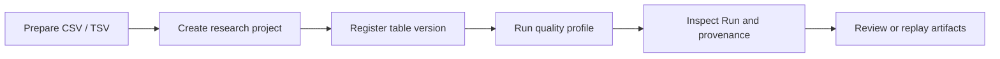

# Science Workbench: Deployment and Experiment Workflow

The Science workbench registers local CSV/TSV experiment tables, inspects column structure and missing values, and runs a traceable deterministic quality profile. This page covers release deployment, source development, desktop packaging, the complete workflow, storage locations, and troubleshooting.

> The current quality profile runs entirely on the local machine. It does not require a model API key and does not send table contents to a model. It is a structural and data-quality sample of at most 100 rows, not full-dataset statistics, significance testing, or a scientific conclusion.

## Choose a deployment mode

| Scenario | Recommended mode | Complete Science interaction |
| --- | --- | --- |
| Normal use | Install a desktop release that includes Science | Yes |
| Development and debugging | Run Electron from source | Yes |
| Local API or renderer debugging | Run Server + Web UI separately | Partial |
| Internal distribution | Build an installer on the target OS | Yes |

The Science entry is available only in packages built from code that includes this feature. Until such a release is published, run Electron from source or build a local package.

## Prerequisites

- [Bun](https://bun.sh/) 1.3.x. The repository currently pins `bun@1.3.12` in `packageManager`.
- An available Node.js executable; desktop build scripts invoke `node`.
- Git.
- `rg` (ripgrep) is recommended because the desktop sidecar build stages the host binary into application resources.
- An existing writable directory for the research project.

Install root and desktop dependencies separately on the first source run:

```bash
cd /absolute/path/to/ScienceX
bun install

cd desktop
bun install
```

When using only the local Science quality profile, you do not need a `.env` file or a configured model provider. Configure a provider through [Environment Variables](../guide/env-vars.md) only if you also use AI chat.

## Mode 1: Run the desktop app from source

Electron starts the local server sidecar automatically and connects through a dynamic loopback port. You do not need to start `src/server/index.ts` manually.

```bash
cd /absolute/path/to/ScienceX/desktop

# Run once initially, and again after server/sidecar changes
bun run build:sidecars

# Build Electron main/preload and start Vite plus Electron
bun run electron:dev
```

Open **Science** from the left navigation after the desktop window appears. Use `Ctrl+C` to stop the development processes.

If only React UI code changed, the existing sidecar can usually be reused. Rebuild it after changes under `src/server/`, `desktop/sidecars/`, or root dependencies.

## Mode 2: Install or distribute a desktop package

A production desktop package bundles the renderer, Electron main/preload, and local server sidecar. End users start the application directly; there is no separate database or server deployment.

Run the repository's target-specific script on the matching operating system and architecture:

```bash
# macOS Apple Silicon
cd desktop
bun run build:macos-arm64

# Windows x64 (PowerShell)
cd desktop
bun run build:windows-x64

# Linux x64
cd desktop
bun run build:linux-x64

# Linux ARM64
cd desktop
bun run build:linux-arm64
```

By default, these scripts install root and desktop dependencies, build the sidecar, package the app, and run a package smoke check. Set `SKIP_INSTALL=1` when dependencies are already installed. Canonical output locations are:

| Platform | Output directory |
| --- | --- |
| macOS ARM64 | `desktop/build-artifacts/macos-arm64/` |
| Windows x64 | `desktop/build-artifacts/windows-x64/` |
| Linux x64 | `desktop/build-artifacts/linux-x64/` |
| Linux ARM64 | `desktop/build-artifacts/linux-arm64/` |

Local unsigned macOS builds disable identity auto-discovery and notarization by default. Public macOS distribution still requires Developer ID signing and notarization; follow [Electron Release and Auto-Update](../../desktop/10-release-auto-update.md). A Windows build host needs Visual Studio 2022 Build Tools with the C++ workload.

## Mode 3: Run Server + Web UI separately

This mode is intended for REST API or renderer debugging, not as the preferred complete Science workflow. A browser can browse the server filesystem and create a project, but the **Add table** button depends on a native desktop file dialog. Use the REST API to register a table in browser mode.

In terminal 1, start the server from the repository root:

```bash
cd /absolute/path/to/ScienceX
SERVER_HOST=127.0.0.1 SERVER_PORT=3456 bun run src/server/index.ts
```

In terminal 2, start the Web UI:

```bash
cd /absolute/path/to/ScienceX/desktop
bun run dev -- --host 127.0.0.1 --port 2024
```

Open `http://127.0.0.1:2024`. The UI connects to `http://127.0.0.1:3456` by default. Set `VITE_DESKTOP_SERVER_URL` before starting Vite if the server uses another port.

PowerShell equivalent for the server variables:

```powershell
$env:SERVER_HOST = "127.0.0.1"
$env:SERVER_PORT = "3456"
bun run src/server/index.ts
```

Do not bind an unauthenticated server to a public interface for convenience. Science APIs can read local files on the server host, and the current data model is not a multi-tenant isolation model. Remote access should use the existing H5 authentication flow with minimal filesystem permissions.

## Run an experiment-table analysis



### 1. Prepare a table

The current implementation supports:

- `.csv` and `.tsv` files with a header row.
- UTF-8 text tables.
- A 2 GB registration limit per file.
- At most the first 4 MB and 100 data rows for preview and profiling.

The table may be inside the research project or another permitted local directory. Keeping it under the project's `data/` directory is recommended for backup and migration.

### 2. Create a research project

1. Open **Science** from the left navigation.
2. Select **New research project**.
3. Enter a name and optional research question.
4. Choose an existing local directory.
5. Select **Create research project**.

ScienceX writes `.sciencex/project.yaml` and `.sciencex/research.sqlite` into that directory. Creation fails if the directory is not writable.

### 3. Register an experiment table

1. Select the new project.
2. Select **Add table** and choose a CSV/TSV file.
3. On **Data**, inspect inferred types, missing counts, unique counts, and sampled rows.

Registration hashes the complete file with SHA-256 and records its size, modification time, and canonical absolute path. **The source table is not copied into `.sciencex`**, so do not delete or move it after registration.

After modifying the source file, select the same file again to create a new dataset version. Existing Runs become `stale`, while their events and artifacts remain available.

### 4. Run the quality profile

1. Select the target table.
2. Select **Run quality profile**.
3. Open **Runs**.

The built-in `table-quality-v1` recipe records:

- Input dataset version and SHA-256.
- Recipe name, recipe hash, and parameters.
- Bun version, operating system, and CPU architecture.
- Start/end times, exit code, and run status.
- Sampled dimensions, complete rows, missing cells, numeric columns, and deterministic warnings.

Statuses are `queued`, `running`, `completed`, `failed`, and `interrupted`. After an unexpected application exit, leftover queued or running records are recovered as `interrupted` the next time they are read.

### 5. Inspect provenance and artifacts

The Runs page displays the append-only event timeline, including events such as:

- `run.created`
- `run.started`
- `artifact.created`
- `run.completed` or `run.failed`

The Artifacts page records each artifact's relative path, size, content hash, and producing Run. Every successful run creates:

- `quality-report.md`: a human-readable quality report.
- `profile.json`: structured column-profile data for downstream tools.

Selecting **Replay run** creates a new child Run using the original dataset and parameters. It never overwrites history.

## Files and storage locations

For a research project at `/work/my-study`, one completed run produces:

```text
/work/my-study/
├── data/
│   └── experiment.csv
├── .sciencex/
│   ├── project.yaml
│   ├── research.sqlite
│   └── runs/
│       └── <run-id>/
│           ├── events.jsonl
│           └── run.json
└── artifacts/
    └── sciencex/
        └── <run-id>/
            ├── quality-report.md
            └── profile.json
```

The global project index defaults to:

```text
~/.claude/science/projects-v1.sqlite
```

When `CLAUDE_CONFIG_DIR` is set, or a portable data directory is enabled in desktop settings, the index is stored at:

```text
<CLAUDE_CONFIG_DIR>/science/projects-v1.sqlite
```

A backup should include `.sciencex/`, `artifacts/`, and every registered source table. Project roots and dataset sources currently use absolute paths. Moving either makes existing registrations unavailable, and the current version has no automatic relink workflow.

## REST API automation

With the local server on port `3456`, call these endpoints in order. Replace angle-bracket placeholders with real IDs. File paths must be absolute paths on the server host.

```bash
# Health check
curl -sS http://127.0.0.1:3456/health

# 1. Create a project; save project.id from the response
curl -sS -X POST http://127.0.0.1:3456/api/research-projects \
  -H 'Content-Type: application/json' \
  -d '{"name":"Pilot study","question":"Are the input tables analysis-ready?","rootDir":"/absolute/path/to/study"}'

# 2. Register a table; save dataset.id from the response
curl -sS -X POST http://127.0.0.1:3456/api/research-projects/<project-id>/datasets \
  -H 'Content-Type: application/json' \
  -d '{"filePath":"/absolute/path/to/study/data/experiment.csv"}'

# 3. Create a quality-profile Run
curl -sS -X POST http://127.0.0.1:3456/api/research-projects/<project-id>/runs \
  -H 'Content-Type: application/json' \
  -d '{"datasetId":"<dataset-id>","recipe":"table-quality-v1","parameters":{"maxRows":100}}'

# 4. Read runs, events, and artifacts
curl -sS http://127.0.0.1:3456/api/research-projects/<project-id>/runs
curl -sS http://127.0.0.1:3456/api/runs/<run-id>/events
curl -sS http://127.0.0.1:3456/api/research-projects/<project-id>/artifacts

# 5. Replay a historical Run
curl -sS -X POST http://127.0.0.1:3456/api/runs/<run-id>/replay \
  -H 'Content-Type: application/json' \
  -d '{}'
```

Default filesystem access allows the user's home directory, `/tmp` (`/private/tmp` on macOS), and registered workspace roots. A symlink's final target must still remain within an allowed root.

## Verify a deployment

Run at least these deterministic checks in development:

```bash
# Science server regression tests
bun test src/server/__tests__/science-workspace.test.ts

# Science desktop store and page tests
cd desktop
bun run test -- --run src/stores/scienceStore.test.ts src/pages/ScienceWorkspace.test.tsx

# Full desktop check
cd ..
bun run check:desktop

# Documentation build
bun run docs:build
```

Before distributing an installer, also run `bun run check:native`. It builds sidecars, checks Electron, generates an unpacked package for the current platform, and runs the package smoke, so it takes substantially longer than normal development checks.

## Troubleshooting

### Electron reports that the sidecar is missing

Run from `desktop/`:

```bash
bun run build:sidecars
bun run electron:dev
```

### The table reports “source changed after registration”

The source file size or modification time changed. Add the same file again in Science to create a new version, then run the profile against that version. Do not edit `.sciencex/research.sqlite` directly.

### The project shows “root unavailable”

The project directory was moved, renamed, unmounted, or is not accessible to the process. Restore it to its registered absolute path and refresh. The current version does not provide automatic relinking.

### “Add table” is unavailable in a browser

This is a current limitation. Use source Electron/a desktop package, or register the table through the REST datasets endpoint.

### The quality report contains fewer rows than the source table

This is expected. The current recipe profiles at most 100 safely parsed sample rows and marks the result as sampled beyond 4 MB or 100 rows. The report is not full-dataset statistics.

### Is a model API key required?

No. Project creation, table preview, `table-quality-v1`, provenance, artifacts, and replay are deterministic local features. A model provider is required only for the project's AI chat capabilities.
