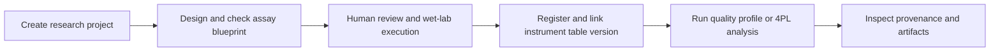

# Science Workbench: Deployment and Experiment Workflow

The Science workbench designs plate-based cell viability assays, registers local CSV/TSV experiment tables, inspects data structure, and runs either a traceable quality profile or a single-plate 4PL dose-response analysis. This page covers release deployment, source development, desktop packaging, the complete workflow, storage locations, and troubleshooting.

> Assay blueprints and built-in analyses run entirely on the local machine, require no model API key, and do not send table contents to a model. “Ready” means only that a design passed preflight checks. The quality profile samples at most 100 rows; the 4PL recipe processes one pinned 96-well plate version. Neither proves wet-lab completion, biological-replicate inference, significance testing, statistical sign-off, or a scientific conclusion.

## Choose a deployment mode

| Scenario | Recommended mode | Complete Science interaction |
| --- | --- | --- |
| Normal use | Install a desktop release that includes Science | Yes |
| Development and debugging | Run Electron from source | Yes |
| Local API or renderer debugging | Run Server + Web UI separately | Partial |
| Internal distribution | Build an installer on the target OS | Yes |

The Science entry is available only in packages built from code that includes this feature. Until such a release is published, run Electron from source or build a local package.

## Prerequisites

- [Bun](https://bun.sh/) 1.3.x. The repository currently pins `bun@1.3.12` in `packageManager`.
- An available Node.js executable; desktop build scripts invoke `node`.
- Git.
- `rg` (ripgrep) is recommended because the desktop sidecar build stages the host binary into application resources.
- An existing writable directory for the research project.

Install root and desktop dependencies separately on the first source run:

```bash
cd /absolute/path/to/ScienceX
bun install

cd desktop
bun install
```

When using only the local Science quality profile, you do not need a `.env` file or a configured model provider. Configure a provider through [Environment Variables](../guide/env-vars.md) only if you also use AI chat.

## Mode 1: Run the desktop app from source

Electron starts the local server sidecar automatically and connects through a dynamic loopback port. You do not need to start `src/server/index.ts` manually.

```bash
cd /absolute/path/to/ScienceX/desktop

# Run once initially, and again after server/sidecar changes
bun run build:sidecars

# Build Electron main/preload and start Vite plus Electron
bun run electron:dev
```

Open **Science** from the left navigation after the desktop window appears. Use `Ctrl+C` to stop the development processes.

If only React UI code changed, the existing sidecar can usually be reused. Rebuild it after changes under `src/server/`, `desktop/sidecars/`, or root dependencies.

## Mode 2: Install or distribute a desktop package

A production desktop package bundles the renderer, Electron main/preload, and local server sidecar. End users start the application directly; there is no separate database or server deployment.

Run the repository's target-specific script on the matching operating system and architecture:

```bash
# macOS Apple Silicon
cd desktop
bun run build:macos-arm64

# Windows x64 (PowerShell)
cd desktop
bun run build:windows-x64

# Linux x64
cd desktop
bun run build:linux-x64

# Linux ARM64
cd desktop
bun run build:linux-arm64
```

By default, these scripts install root and desktop dependencies, build the sidecar, package the app, and run a package smoke check. Set `SKIP_INSTALL=1` when dependencies are already installed. Canonical output locations are:

| Platform | Output directory |
| --- | --- |
| macOS ARM64 | `desktop/build-artifacts/macos-arm64/` |
| Windows x64 | `desktop/build-artifacts/windows-x64/` |
| Linux x64 | `desktop/build-artifacts/linux-x64/` |
| Linux ARM64 | `desktop/build-artifacts/linux-arm64/` |

Local unsigned macOS builds disable identity auto-discovery and notarization by default. Public macOS distribution still requires Developer ID signing and notarization; follow [Electron Release and Auto-Update](../../desktop/10-release-auto-update.md). A Windows build host needs Visual Studio 2022 Build Tools with the C++ workload.

## Mode 3: Run Server + Web UI separately

This mode is intended for REST API or renderer debugging, not as the preferred complete Science workflow. A browser can browse the server filesystem and create a project, but the **Add table** button depends on a native desktop file dialog. Use the REST API to register a table in browser mode.

In terminal 1, start the server from the repository root:

```bash
cd /absolute/path/to/ScienceX
SERVER_HOST=127.0.0.1 SERVER_PORT=3456 bun run src/server/index.ts
```

In terminal 2, start the Web UI:

```bash
cd /absolute/path/to/ScienceX/desktop
bun run dev -- --host 127.0.0.1 --port 2024
```

Open `http://127.0.0.1:2024`. The UI connects to `http://127.0.0.1:3456` by default. Set `VITE_DESKTOP_SERVER_URL` before starting Vite if the server uses another port.

PowerShell equivalent for the server variables:

```powershell
$env:SERVER_HOST = "127.0.0.1"
$env:SERVER_PORT = "3456"
bun run src/server/index.ts
```

Do not bind an unauthenticated server to a public interface for convenience. Science APIs can read local files on the server host, and the current data model is not a multi-tenant isolation model. Remote access should use the existing H5 authentication flow with minimal filesystem permissions.

## Try the built-in example in three minutes

The desktop app includes a cell-viability teaching example generated entirely on the local machine. It demonstrates the complete path from a research question to evidence and replay without requiring an instrument file or model API key:

1. Open **Science** from the left navigation and select **Try a complete experiment**.
2. Choose an existing writable parent directory. ScienceX creates a separate example copy and does not overwrite existing files.
3. Keep the optional defense challenges enabled to include changed-data, missing-well, and inconclusive-evidence scenarios.
4. Inspect the research question, versioned assay blueprint, and simulated data, then select **Run complete demonstration**.
5. Use the scenario cards, Runs, and Artifacts to review successful analysis, pinned-version replay, explicit failure, and inconclusive evidence.

The standard scenario assigns 24 wells and is expected to produce a relative IC50 near 1 µM, R² > 0.99, and three hashed research artifacts. All inputs are deterministically generated teaching data. These values validate the product workflow; they do not establish real efficacy, wet-lab results, or a scientific conclusion. Every repeat creates new Runs and preserves earlier inputs and results.

## Run an experiment-table analysis


```mermaid
flowchart LR
  A["Create research project"] --> B["Design and check assay blueprint"]
  B --> C["Human review and wet-lab execution"]
  C --> D["Register and link instrument table version"]
  D --> E["Run quality profile or 4PL analysis"]
  E --> F["Inspect provenance and artifacts"]
```

### 1. Prepare a table

The current implementation supports:

- `.csv` and `.tsv` files with a header row.
- UTF-8 text tables.
- A 2 GB registration limit per file.
- At most the first 4 MB and 100 data rows for preview and profiling.

The table may be inside the research project or another permitted local directory. Keeping it under the project's `data/` directory is recommended for backup and migration.

### 2. Create a research project

1. Open **Science** from the left navigation.
2. Select **New research project**.
3. Enter a name and optional research question.
4. Choose an existing local directory.
5. Select **Create research project**.

ScienceX writes `.sciencex/project.yaml` and `.sciencex/research.sqlite` into that directory. Creation fails if the directory is not writable.

### 3. Design a cell viability assay

1. Open **Experiments**.
2. Enter the experiment name, cell line, compound, treatment duration, and seeding density.
3. Choose `CCK-8 · OD450` or `CellTiter-Glo · luminescence`.
4. Enter 4–8 non-zero dose levels, one common unit, and 3–8 replicates per group.
5. Keep blank and vehicle controls; add a positive control when the assay requires one.
6. Confirm that preflight passes, then save the assay blueprint.

ScienceX stores the biological setup as a `protocolVersion` and the generated 96-well assignment as a `designVersion`. Each control or dose group occupies a column and replicates are assigned down rows A–H. These conditions block “Ready”:

- Missing cell line, compound, duration, seeding density, or dose unit.
- Fewer than four non-zero doses, duplicate doses, or non-positive values.
- Fewer than three replicate wells per group.
- Missing blank control or a valid vehicle control.
- A design that exceeds one 96-well plate, contains invalid or duplicate wells, or lacks required assignments.

A positive control is a warning rather than a universal blocker in this generic template. Its necessity remains an assay-specific expert decision. “Ready” still requires a scientist to review culture conditions, reagents, instrumentation, safety, and laboratory SOPs before wet-lab execution.

### 4. Execute the assay, register the readout, and link it

1. Execute the human-reviewed wet-lab protocol and export a CSV/TSV from the instrument.
2. Select the project, choose **Add table**, and select the exported file.
3. Return to **Experiments**, choose the registered readout table for the blueprint, and save the link.
4. On **Data**, inspect inferred types, missing counts, unique counts, and sampled rows.

Registration hashes the complete file with SHA-256, records its size, modification time, and canonical absolute path, and creates a content-addressed immutable snapshot under `.sciencex/objects/sha256/`. Linking also pins the current `datasetVersionId`; later re-registration cannot silently rewrite the experiment reference. Historical Runs read their registered version from that snapshot; the absolute source path remains the location used for current preview and re-registration.

After modifying the source file, select it again to create a new dataset version. Existing Runs keep their replay verification state and are separately labelled as using historical input; their events and artifacts remain available.

### 5. Run an analysis

#### General table quality profile

1. Select the target table.
2. Select **Run quality profile**.
3. Open **Runs**.

The built-in `table-quality-v1` recipe records:

- Input dataset version and SHA-256.
- Recipe name, recipe hash, and parameters.
- Bun version, operating system, and CPU architecture.
- Start/end times, exit code, and run status.
- Sampled dimensions, complete rows, missing cells, numeric columns, and deterministic warnings.

Statuses are `queued`, `running`, `completed`, `failed`, and `interrupted`. After an unexpected application exit, leftover queued or running records are recovered as `interrupted` the next time they are read.

#### Cell-viability dose response

1. Open an assay blueprint with a linked readout table.
2. Explicitly select the well and signal columns. The UI offers convenience defaults only for common exact headers; the service does not fuzzy-guess columns.
3. Select **Run 4PL analysis**, then review the curve, replicate mean/SD, relative IC50, Hill slope, R², RMSE, and warnings on **Runs**.

The built-in `cell-viability-dose-response-v1` recipe is pinned to the blueprint's `datasetVersionId`, `protocolVersion`, and `designVersion`. Every designed well must appear exactly once, wells must match `A1`–`H12`, assigned signals must be present and finite, and the table must fit the safe single-plate parse limit. A missing, duplicate, or invalid well or a non-numeric signal fails the Run rather than imputing data or switching to a newer current version.

The calculation order is fixed:

```text
blank-corrected = raw signal - mean(blank signals)
normalized viability (%) = 100 × blank-corrected / mean(blank-corrected vehicle signals)
4PL: y = bottom + (top - bottom) / (1 + (dose / relative IC50) ^ Hill slope)
```

Blank and vehicle wells are used for correction and normalization; the 4PL fit uses individual treatment-replicate observations. “Relative IC50” is the midpoint between the fitted top and bottom rather than an absolute inhibitory concentration with fixed 0% and 100% boundaries. See the [NCBI Assay Guidance Manual](https://www.ncbi.nlm.nih.gov/books/NBK91993/) and its [dose-response fitting operations chapter](https://www.ncbi.nlm.nih.gov/sites/books/NBK91994/) for the method boundary.

Deterministic review warnings are raised when any dose has replicate CV above 20%, the observed response span is below 30 percentage points, R² is below 0.80, relative IC50 lies outside the tested range, or fitted asymptotes fall outside the automated plausibility range. These are screening rules, not domain acceptance criteria; an out-of-range IC50 is extrapolation only. The current recipe provides no confidence interval, independent biological-replicate aggregation, alternative-model comparison, or statistical/biological sign-off.

### 6. Inspect provenance and artifacts

The Runs page displays the append-only event timeline, including events such as:

- `run.created`
- `run.started`
- `artifact.created`
- `run.completed` or `run.failed`

The Artifacts page records each artifact's relative path, size, content hash, and producing Run. A successful quality profile creates:

- `quality-report.md`: a human-readable quality report.
- `profile.json`: structured column-profile data for downstream tools.

A successful dose-response analysis creates:

- `dose-response-report.md`: a human-review report with pinned inputs, method, fit parameters, warnings, and interpretation limits.
- `normalized-wells.csv`: well-level raw signals, blank-corrected values, and normalized viability.
- `dose-response.json`: replicate summaries, 4PL curve, relative IC50, and machine-readable warnings.

Selecting **Replay run** creates a child Run pinned to the original `datasetVersionId`, input hash, recipe, and parameters. A first successful execution remains “not replay-verified”; the parent and child become “replay verified” only when their deterministic summaries match. History is never overwritten.

This vertical slice covers “assay design → preflight → human wet-lab work → versioned data registration/link → explicit well mapping → blank correction and vehicle normalization → replicate summary and single-plate 4PL / relative IC50 → provenance/artifacts/replay.” Independent biological-replicate aggregation, confidence intervals, model comparison, statistical review, and conclusion sign-off remain later stages.

## Files and storage locations

For a research project at `/work/my-study`, one completed run produces:

```text
/work/my-study/
├── data/
│   └── experiment.csv
├── .sciencex/
│   ├── project.yaml
│   ├── research.sqlite
│   ├── objects/sha256/       # Content-addressed managed input snapshots
│   └── runs/
│       └── <run-id>/
│           ├── events.jsonl
│           └── run.json
└── artifacts/
    └── sciencex/
        └── <run-id>/
            ├── quality-report.md
            ├── profile.json
            ├── dose-response-report.md
            ├── normalized-wells.csv
            └── dose-response.json
```

The global project index defaults to:

```text
~/.sciencex/data/science/projects-v1.sqlite
```

When `CLAUDE_CONFIG_DIR` is set, or a portable data directory is enabled in desktop settings, the index is stored at:

```text
<CLAUDE_CONFIG_DIR>/science/projects-v1.sqlite
```

A backup should include `.sciencex/` and `artifacts/`; `.sciencex/objects/` contains the managed input snapshots required for exact replay. Project roots and dataset sources still use absolute paths. Moving the project root makes its registration unavailable, while moving a source table affects current preview and re-registration but does not invalidate replay of an existing managed version. The current version has no automatic relink workflow.

## REST API automation

With the local server on port `3456`, call these endpoints in order. Replace angle-bracket placeholders with real IDs. File paths must be absolute paths on the server host.

```bash
# Health check
curl -sS http://127.0.0.1:3456/health

# 1. Create a project; save project.id from the response
curl -sS -X POST http://127.0.0.1:3456/api/research-projects \
  -H 'Content-Type: application/json' \
  -d '{"name":"Pilot study","question":"Are the input tables analysis-ready?","rootDir":"/absolute/path/to/study"}'

# 2. Create an assay blueprint; save experiment.id from the response
curl -sS -X POST http://127.0.0.1:3456/api/research-projects/<project-id>/experiments \
  -H 'Content-Type: application/json' \
  -d '{"name":"X-402 · A549 · 48 h","assayType":"cell-viability-dose-response","protocol":{"cellLine":"A549","compoundName":"X-402","readout":"cck-8","treatmentDurationHours":48,"seedingDensityCellsPerWell":4000,"concentrationUnit":"µM","concentrations":[0.01,0.1,1,5,25,100],"replicateCount":3,"includeBlankControl":true,"vehicleControl":{"name":"DMSO","finalPercent":0.1},"positiveControl":""}}'

# 3. After wet-lab execution, register the instrument table; save dataset.id
curl -sS -X POST http://127.0.0.1:3456/api/research-projects/<project-id>/datasets \
  -H 'Content-Type: application/json' \
  -d '{"filePath":"/absolute/path/to/study/data/experiment.csv"}'

# 4. Link the experiment to the current dataset version
curl -sS -X PATCH http://127.0.0.1:3456/api/research-projects/<project-id>/experiments/<experiment-id> \
  -H 'Content-Type: application/json' \
  -d '{"datasetId":"<dataset-id>"}'

# 5. Create a quality-profile Run
curl -sS -X POST http://127.0.0.1:3456/api/research-projects/<project-id>/runs \
  -H 'Content-Type: application/json' \
  -d '{"datasetId":"<dataset-id>","recipe":"table-quality-v1","parameters":{"maxRows":100}}'

# 6. Create a 4PL dose-response Run pinned to the experiment versions
curl -sS -X POST http://127.0.0.1:3456/api/research-projects/<project-id>/experiments/<experiment-id>/runs \
  -H 'Content-Type: application/json' \
  -d '{"recipe":"cell-viability-dose-response-v1","parameters":{"wellColumn":"well","signalColumn":"signal"}}'

# 7. Read experiments, runs, events, and artifacts
curl -sS http://127.0.0.1:3456/api/research-projects/<project-id>/experiments
curl -sS http://127.0.0.1:3456/api/research-projects/<project-id>/runs
curl -sS http://127.0.0.1:3456/api/runs/<run-id>/events
curl -sS http://127.0.0.1:3456/api/research-projects/<project-id>/artifacts

# 8. Replay a historical Run
curl -sS -X POST http://127.0.0.1:3456/api/runs/<run-id>/replay \
  -H 'Content-Type: application/json' \
  -d '{}'
```

Default filesystem access allows the user's home directory, `/tmp` (`/private/tmp` on macOS), and registered workspace roots. A symlink's final target must still remain within an allowed root.

## Verify a deployment

Run at least these deterministic checks in development:

```bash
# Science server regression tests
bun test src/server/services/scienceDoseResponseAnalysis.test.ts src/server/__tests__/science-dose-response.test.ts src/server/__tests__/science-experiments.test.ts src/server/__tests__/science-workspace.test.ts

# Science desktop store and page tests
cd desktop
bun run test -- --run src/stores/scienceStore.test.ts src/pages/ScienceWorkspace.test.tsx

# Full desktop check
cd ..
bun run check:desktop

# Documentation build
bun run docs:build
```

Before distributing an installer, also run `bun run check:native`. It builds sidecars, checks Electron, generates an unpacked package for the current platform, and runs the package smoke, so it takes substantially longer than normal development checks.

## Troubleshooting

### Electron reports that the sidecar is missing

Run from `desktop/`:

```bash
bun run build:sidecars
bun run electron:dev
```

### The table reports “source changed after registration”

The source file size or modification time changed. Add the same file again in Science to create a new version, then run the profile against that version. Do not edit `.sciencex/research.sqlite` directly.

### The project shows “root unavailable”

The project directory was moved, renamed, unmounted, or is not accessible to the process. Restore it to its registered absolute path and refresh. The current version does not provide automatic relinking.

### “Add table” is unavailable in a browser

This is a current limitation. Use source Electron/a desktop package, or register the table through the REST datasets endpoint.

### The quality report contains fewer rows than the source table

This is expected. The current recipe profiles at most 100 safely parsed sample rows and marks the result as sampled beyond 4 MB or 100 rows. The report is not full-dataset statistics.

### Is a model API key required?

No. Project creation, table preview, `table-quality-v1`, provenance, artifacts, and replay are deterministic local features. A model provider is required only for the project's AI chat capabilities.
