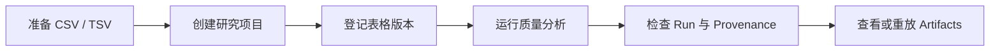

# Science 工作台：部署与实验执行

Science 工作台用于登记本地 CSV/TSV 实验表格、检查列结构和缺失值，并执行可追溯的确定性质量分析。本页覆盖安装包部署、源码开发、桌面打包、完整操作流程、数据目录和故障排查。

> 当前质量分析完全在本机运行，不需要模型 API Key，也不会把表格内容发送给模型。它是最多 100 行的结构与数据质量抽样，不是完整数据集统计、显著性检验或科学结论。

## 选择部署方式

| 场景 | 推荐方式 | Science 完整交互 |
| --- | --- | --- |
| 普通使用 | 安装包含 Science 功能的桌面 Release | 支持 |
| 开发和调试 | 从源码运行 Electron | 支持 |
| 本地接口或前端调试 | 独立启动 Server + Web UI | 部分支持 |
| 内部分发 | 在目标操作系统上构建安装包 | 支持 |

只有基于包含本功能的代码构建出来的安装包才会显示 Science 入口。在正式 Release 发布之前，请使用源码 Electron 或自行构建的安装包。

## 前置要求

- [Bun](https://bun.sh/) 1.3.x；仓库的 `packageManager` 当前固定为 `bun@1.3.12`。
- 可执行的 Node.js，桌面构建脚本会调用 `node`。
- Git。
- 推荐安装 `rg`（ripgrep），桌面 sidecar 构建会把本机版本暂存到应用资源中。
- 至少准备一个已存在且可写的实验项目目录。

首次从源码运行需要分别安装根目录和桌面端依赖：

```bash
cd /absolute/path/to/ScienceX
bun install

cd desktop
bun install
```

仅使用 Science 的本地质量分析时，可以不创建 `.env`，也不需要配置模型提供商。如果还要使用 AI 对话，再参考[环境变量](../guide/env-vars.md)配置提供商。

## 方式一：运行源码桌面端（推荐开发方式）

Electron 会自动启动本地 server sidecar，并通过动态 loopback 端口连接，不需要手工启动 `src/server/index.ts`。

```bash
cd /absolute/path/to/ScienceX/desktop

# 首次运行，或 server/sidecar 代码变化后执行
bun run build:sidecars

# 构建 Electron main/preload，启动 Vite 和 Electron
bun run electron:dev
```

出现桌面窗口后，从左侧导航进入 **Science**。使用 `Ctrl+C` 停止开发进程。

如果只修改了 React 界面，通常可以直接复用已构建的 sidecar；如果修改了 `src/server/`、`desktop/sidecars/` 或根依赖，应重新运行 `bun run build:sidecars`。

## 方式二：安装或分发桌面包

正式桌面包会把 renderer、Electron main/preload 和本地 server sidecar 一起打包。最终用户启动应用即可，不需要单独部署数据库或服务端。

仓库提供以下目标平台构建脚本；应在对应操作系统和架构上执行：

```bash
# macOS Apple Silicon
cd desktop
bun run build:macos-arm64

# Windows x64（PowerShell）
cd desktop
bun run build:windows-x64

# Linux x64
cd desktop
bun run build:linux-x64

# Linux ARM64
cd desktop
bun run build:linux-arm64
```

脚本默认会安装根目录和桌面依赖、构建 sidecar、打包并执行 package smoke。依赖已安装时可设置 `SKIP_INSTALL=1`。规范化输出目录为：

| 平台 | 输出目录 |
| --- | --- |
| macOS ARM64 | `desktop/build-artifacts/macos-arm64/` |
| Windows x64 | `desktop/build-artifacts/windows-x64/` |
| Linux x64 | `desktop/build-artifacts/linux-x64/` |
| Linux ARM64 | `desktop/build-artifacts/linux-arm64/` |

macOS 本地未签名构建默认关闭身份自动发现和公证。面向外部分发的 macOS 构建仍需 Developer ID 签名与 notarization；Release 流程以[Electron 发布与更新](../desktop/10-release-auto-update.md)为准。Windows 构建机需要 Visual Studio 2022 Build Tools 的 C++ workload。

## 方式三：独立 Server + Web UI

该方式适合调试 REST API 或 renderer，不是当前完整 Science 操作的首选。浏览器可以浏览服务端文件系统并创建项目，但 **添加表格**按钮依赖桌面原生文件对话框；浏览器模式下应改用 REST API 登记表格。

终端 1，在项目根目录启动服务端：

```bash
cd /absolute/path/to/ScienceX
SERVER_HOST=127.0.0.1 SERVER_PORT=3456 bun run src/server/index.ts
```

终端 2，启动 Web UI：

```bash
cd /absolute/path/to/ScienceX/desktop
bun run dev -- --host 127.0.0.1 --port 2024
```

打开 `http://127.0.0.1:2024`。前端默认连接 `http://127.0.0.1:3456`；如果服务端使用其他端口，在启动前端时设置 `VITE_DESKTOP_SERVER_URL`。

PowerShell 中可这样设置服务端端口：

```powershell
$env:SERVER_HOST = "127.0.0.1"
$env:SERVER_PORT = "3456"
bun run src/server/index.ts
```

不要为了方便直接把未配置访问控制的服务绑定到公网地址。Science API 可以读取服务端主机上的本地文件，当前数据模型也不是多租户隔离模型。远程访问应使用项目已有的 H5 认证流程，并保持最小文件系统权限。

## 执行一次实验表格分析



### 1. 准备表格

当前支持：

- `.csv` 和 `.tsv`；第一行必须是表头。
- UTF-8 文本表格。
- 单文件最大登记大小 2 GB。
- 预览最多读取文件前 4 MB，并最多返回 100 行数据。

表格可以位于研究项目目录内，也可以位于其他允许访问的本地目录。推荐放入项目的 `data/` 目录，便于整体备份和迁移。

### 2. 创建研究项目

1. 打开左侧 **Science**。
2. 点击**新建研究项目**。
3. 输入项目名称和可选的研究问题。
4. 选择一个已经存在的本地目录。
5. 点击**创建研究项目**。

创建后，ScienceX 会在该目录写入 `.sciencex/project.yaml` 和 `.sciencex/research.sqlite`。如果目录不可写，创建会失败。

### 3. 登记实验表格

1. 选择刚创建的项目。
2. 点击**添加表格**并选择 CSV/TSV。
3. 在 **Data** 页检查推断类型、缺失数、唯一值数和样本行。

登记会计算完整文件的 SHA-256，并保存文件大小、修改时间和规范化绝对路径。**原始表格不会被复制进 `.sciencex`**，因此不能在登记后删除或随意移动源文件。

如果修改了原文件，再次选择同一个文件会创建新的数据版本。旧 Run 会被标记为 `stale`，但旧 Run、事件和产物仍保留。

### 4. 运行质量分析

1. 选择目标表格。
2. 点击**运行质量分析**。
3. 切换到 **Runs**。

内置配方 `table-quality-v1` 会记录：

- 输入数据版本和 SHA-256。
- 配方名称、配方哈希和参数。
- Bun 版本、操作系统和 CPU 架构。
- 开始/结束时间、退出码和运行状态。
- 抽样行列数、完整行、缺失单元格、数值列和确定性告警。

运行状态包括 `queued`、`running`、`completed`、`failed` 和 `interrupted`。应用异常退出后，遗留的排队中或运行中记录会在下次读取时恢复为 `interrupted`。

### 5. 检查 Provenance 和产物

Runs 页会显示 append-only 事件时间线，例如：

- `run.created`
- `run.started`
- `artifact.created`
- `run.completed` 或 `run.failed`

Artifacts 页登记每个产物的相对路径、大小、内容哈希和产生它的 Run。每次成功运行会生成：

- `quality-report.md`：适合人工阅读的数据质量报告。
- `profile.json`：适合程序继续消费的结构化列画像。

点击**重放运行**会使用原 Run 的数据集和参数创建一个新的子 Run，不会覆盖历史记录。

## 文件和数据目录

假设研究项目目录是 `/work/my-study`，一次运行后的结构如下：

```text
/work/my-study/
├── data/
│   └── experiment.csv
├── .sciencex/
│   ├── project.yaml
│   ├── research.sqlite
│   └── runs/
│       └── <run-id>/
│           ├── events.jsonl
│           └── run.json
└── artifacts/
    └── sciencex/
        └── <run-id>/
            ├── quality-report.md
            └── profile.json
```

全局项目索引默认位于：

```text
~/.claude/science/projects-v1.sqlite
```

如果设置了 `CLAUDE_CONFIG_DIR` 或在桌面设置中启用了便携数据目录，则索引位于：

```text
<CLAUDE_CONFIG_DIR>/science/projects-v1.sqlite
```

备份时至少保留项目目录中的 `.sciencex/`、`artifacts/` 和所有被登记的原始表格。当前项目和数据源都保存绝对路径；直接移动项目目录或源表格会使现有登记不可用，目前没有自动重新链接流程。

## REST API 自动化

服务端运行在本机 `3456` 端口时，可按顺序调用以下接口。把尖括号占位符替换为真实值，路径必须是服务端主机上的绝对路径。

```bash
# 健康检查
curl -sS http://127.0.0.1:3456/health

# 1. 创建项目；从响应中保存 project.id
curl -sS -X POST http://127.0.0.1:3456/api/research-projects \
  -H 'Content-Type: application/json' \
  -d '{"name":"Pilot study","question":"Are the input tables analysis-ready?","rootDir":"/absolute/path/to/study"}'

# 2. 登记表格；从响应中保存 dataset.id
curl -sS -X POST http://127.0.0.1:3456/api/research-projects/<project-id>/datasets \
  -H 'Content-Type: application/json' \
  -d '{"filePath":"/absolute/path/to/study/data/experiment.csv"}'

# 3. 创建质量分析 Run
curl -sS -X POST http://127.0.0.1:3456/api/research-projects/<project-id>/runs \
  -H 'Content-Type: application/json' \
  -d '{"datasetId":"<dataset-id>","recipe":"table-quality-v1","parameters":{"maxRows":100}}'

# 4. 读取运行、事件和产物
curl -sS http://127.0.0.1:3456/api/research-projects/<project-id>/runs
curl -sS http://127.0.0.1:3456/api/runs/<run-id>/events
curl -sS http://127.0.0.1:3456/api/research-projects/<project-id>/artifacts

# 5. 重放一个历史 Run
curl -sS -X POST http://127.0.0.1:3456/api/runs/<run-id>/replay \
  -H 'Content-Type: application/json' \
  -d '{}'
```

默认文件系统允许范围是用户主目录、`/tmp`（macOS 也接受 `/private/tmp`）和已登记的工作区根目录。符号链接最终目标仍必须位于允许范围内。

## 验证部署

开发环境至少执行以下确定性检查：

```bash
# Science 服务端回归测试
bun test src/server/__tests__/science-workspace.test.ts

# Science 桌面状态和页面测试
cd desktop
bun run test -- --run src/stores/scienceStore.test.ts src/pages/ScienceWorkspace.test.tsx

# 完整桌面检查
cd ..
bun run check:desktop

# 文档站构建
bun run docs:build
```

准备分发安装包前，再运行 `bun run check:native`。该命令会构建 sidecar、检查 Electron、生成当前平台的 unpacked package，并执行 package smoke，耗时明显长于普通开发检查。

## 常见问题

### Electron 启动时提示 sidecar 不存在

在 `desktop/` 下执行：

```bash
bun run build:sidecars
bun run electron:dev
```

### 表格提示 source changed after registration

源文件的大小或修改时间已经变化。回到 Science，重新添加同一个文件以创建新版本，然后基于新版本运行分析。不要直接修改 `.sciencex/research.sqlite`。

### 项目显示 root unavailable

项目目录被移动、重命名、卸载或当前进程无权访问。把目录恢复到登记时的绝对路径并刷新；当前版本尚未提供自动重新链接。

### 浏览器中“添加表格”不可用

这是当前设计限制。使用源码 Electron/桌面安装包，或通过 REST API 的 datasets 接口登记表格。

### 质量报告的行数小于原始表格

这是预期行为。当前配方最多分析 100 个安全解析的样本行，并在超过 4 MB 或 100 行时标记为抽样。报告不能当作完整数据集统计。

### 是否需要模型 API Key

不需要。项目创建、表格预览、`table-quality-v1`、Provenance、Artifacts 和重放都是本地确定性功能。只有使用项目的 AI 对话能力时才需要配置模型提供商。
